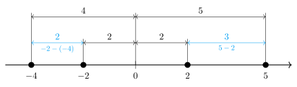

---
{
    "title": "Модуль",
    "desc": "Описание вот этой статьи",
    "tags": ["модуль", "абсолютная величина"]
}
---

# Модуль

С другой стороны сложившаяся структура организации влечет за собой процесс внедрения и модернизации дальнейших направлений развития. Товарищи! реализация намеченных плановых заданий в значительной степени обуславливает создание соответствующий условий активизации. Значимость этих проблем настолько очевидна, что постоянное информационно-пропагандистское обеспечение нашей деятельности позволяет выполнять важные задания по разработке форм развития. Равным образом постоянный количественный рост и сфера нашей активности в значительной степени обуславливает создание соответствующий условий активизации.

## "Величина" числа {: #number-size }

Сначала попытаемся сформулировать понятие о "величине" числа. Из этого понятия естественным образом получим понимание, откуда взялся и как определить модуль.

### Геометрический смысл {: #number-size-analogy-1 }

Представьте, что вы стоите в точке $0$ на числовой оси. Слева от вас, в точке $-100$, находится школа. Справа, в точке $50$, находится ваш дом. Математически число $-100$ меньше, чем $50$. Но вот идти до школы $100$ метров влево гораздо дольше, чем пройти $50$ метров до дома вправо. В этом смысле "величина" пройденного расстояния в $-100$ метров больше, чем $50$ метров.

Пусть теперь школа находится в точке $-10$, а дом в точке $10$. Математически вновь получаем, что $-10$ меньше $10$. Но вот нам, находящимся в $0$, совершенно нет разницы: идти $-10$ метров влево или $10$ метров вправо. В обоих случаях мы пройдем $10$ метров. То есть, по "величине" числа $-10$ и $10$ равны.

### Количественный смысл {: #number-size-analogy-2 }

Рассмотрим числа $50$ и $-100$. В математическом смысле $-100$ гораздо меньше $50$. А давайте посмотрим на эти числа под другим углом. У вас есть всего $50$ рублей и вы задолжали другу. Ваш долг составляет $-100$ рублей. В этом смысле "величина" вашего долга в $-100$ рублей гораздо больше имеющихся у вас $50$ рублей. Получается, что математически $-100$ меньше $50$, но по "величине" $-100$ больше $50$.

Теперь рассмотрим числа $-10$ и $10$. Математически, опять же, $-10$ меньше $10$. Но, пользуясь нашей аналогией с долгом, своими $10$ рублями вы полностью покроете долг в $-10$ рублей. То есть, по "величине" число $-10$ равно числу $10$.

### Понятие величины {: #number-size-def }

Мы поняли, что каждое число имеет свою "величину". Причем эта величина не зависит от того, положительным или отрицательным является число. Можно даже сказать, что "величина" числа это и есть само число, от которого "отбросили" его знак.

## Модуль числа {: #abs-definition }

Сформулируем на строгом языке математики наше интуитивное представление о "величине" числа, которое мы сформировали в предыдущем разделе.

<definition id="abs">
    <def>Модуль</def> или <def>абсолютная величина</def> вещественного числа $x$ — само число $x$, если оно неотрицательно, иначе $-x$.

    $$ |x| = \begin{cases} \phantom{-}x, \text{ если } x\geq 0 \\ -x, \text{ если } x < 0 \end{cases} $$
</definition>

Допустим, мы хотим найти модуль какого-то числа $a$. Согласно определению, нам надо провести элементарную проверку. Если число $a$ положительное или равно $0$, то модулем $a$ и является само $a$. Если же $a$ меньше $0$, то результатом модуля будет $-a$.

<example title="Примеры значений модуля">
    $$ |5| = 5 \qquad |0| = 0 \qquad |-12| = -(-12) = 12 $$
</example>

Легко убедиться, что модуль числа полностью соответсвует по смыслу "величине" числа, рассмотренной в предыдущем разделе. Там мы утверждали, что по "величине" $-100$ больше $50$, а $-10$ равно $10$. И действительно:

$$
\begin{aligned}
|-100| = 100& \qquad |50| = 50 \qquad |-100| > |50|
\\[5px]
|-10| = 10& \qquad |10| = 10 \qquad |-10| = |10|
\end{aligned}
$$

<theorem id="abs-equiv" title="Эквивалентное определение модуля" no-index="true">
    <statement>
        Положение знака нестрогого неравенства в определении модуля не имеет значения:

        $$ |x| = \begin{cases} \phantom{-}x, \text{ если } x\geq 0 \\ -x, \text{ если } x < 0 \end{cases} = \begin{cases} \phantom{-}x, \text{ если } x > 0 \\ -x, \text{ если } x \leq 0 \end{cases} $$
    </statement>
    <proof>
        Обозначим второе определение модуля числа $x$ как $|x|'$. Покажем, что какой $x$ не возьми, будет выполняться $|x| = |x|'$.

        Пусть $x >0$. По классическому определению $|x| = x$. По второму: $|x|' = x$. То есть $|x| = |x|'$.

        Пусть $x=0$. По классическому определению $|0| = 0$. А вот во втором определении $0$ попадает уже под второе условие, то есть $|0|' = -0 = 0$. Опять имеем $|0| = |0|'$.

        Наконец, пусть $x < 0$. По классическому определению $|x| = -x$. У второго определения та же ситуация: $|x|' = -x$. Получается, что и в этом случае $|x| = |x|'$.

        Итак, мы рассмотрели все возможные значения для $x$ и во всех случаях $|x| = |x|'$. Это и означает, что между двумя определениями нет никакой разницы $\blacksquare$
    </proof>
</theorem>

Такое определение иногда бывает полезно. Например, если $x$ лежит в следующих пределах: $-10 \leq x \leq 0$, то можно сразу сказать, что $|x| = -x$, даже несмотря на то, что для $x=0$ так выражаться будет некорректно, ведь $|0| = 0$, а не $-0$.

## Свойства модуля {: #abs-theorems }

У модуля есть очень много полезных свойств, которые сильно помогают при решении уравнений, неравенств, доказательстве теорем и так далее.
Рассмотрим самые полезные из них. Все свойства ниже формулируем для любых вещественных чисел $x$ и $y$.

### Очевидные свойства {: #abs-theorems-trivial }

Наиболее очевидные свойства модуля напрямую вытекают из рассмотренного ранее понятия о "величине" числа. Например, мы определили "величину" числа как само число с "отброшенным" знаком. Это означает, что "величина" не может быть отрицательной.

<theorem id="abs-positive" title="Модуль всегда неотрицателен">
    <statement>$$ |x| \geq 0 $$</statement>
    <proof>
        Рассмотрим произвольное вещественное число $x$. Если $x\geq 0$, то, по определению модуля $|x| = x$, поэтому $|x| \geq 0$. Если $x< 0$, то, по определению модуля $|x| = -x$. Пусть тогда $x<0$. Умножим обе части неравенства на $-1$: $-x > 0$. По определению модуля $|x| = -x$, поэтому $|x| > 0$. Доказали, что вне зависимости от знака $x$ его модуль будет неотрицательным числом. $\blacksquare$
    </proof>
</theorem>

Помимо этого, было бы странно, если "величина" числа оказалсь бы больше, чем само это число. Отсюда еще одно очевидное своство:

<theorem title="Модуль не меньше аргумента">
    <statement>$$ -|x| \leq x \leq |x| $$</statement>
    <proof>
        Докажем правую часть неравенства:

        $$ x \leq |x| $$

        Если $x\geq 0$, то по определению получаем, что $|x|=x$, а значит выполняется $x \leq x$.
        Если $x< 0$, то неравенство $x\leq |x|$ выполняется, так как слева имеем отрицательное число, а число справа всегда <t:[неотрицательное](abs-positive)>.

        Доказательство левой части неравенства проводится аналогично.
    </proof>
</theorem>

Вспоминаем геометрический смысл "величины" числа. Мы выяснили, что нет разницы: иди из $0$ влево $-100$ метров или вправо $100$ метров. В обоих случаях придется идти $100$ метров. Это означает, что "величина" противоположных чисел совпадает, то есть:

<theorem id="abs-inverse-equality" title="Модули противоположных чисел равны">
    <statement>
        $$ |x| = |-x| $$
        **Следствие**: $ |x-y| = |y-x| $
    </statement>
    <proof>
        Если $x\geq 0$, то $|x| = x$ и $|-x|=-(-x) = x$, откуда получаем выполняющееся равенство $x=x$.
        
        Если $x < 0$, то $|x| = -x$ и $|-x|= -x$, откуда получаем также выполняющееся равенство $-x = -x$.

        Для доказательства следствия вынесем в правой части равенства за скобки $-1$:

        $$ |x-y| = \underbrace{|-(x-y)|}_{\normalsize = |y-x|} $$

        По уже доказанному свойству это равенство выполняется.

        $\blacksquare$
    </proof>
</theorem>

Последнее свойство будет уже чуть менее очевидным. Пусть мы умножаем друг на друга два числа. Логично предположить, что "величина" произведения двух чисел будет равна произведению "величин" множителей.

<theorem title="Произведение модулей">
    <statement>
        $$ |x||y| = |xy| $$
    </statement>
    <proof>
        Из <t:[свойства](abs-inverse-equality)> равенства модулей противоположных чисел все равенства ниже выполняются:

        $$ |x||y| = |-x||y| = |x||-y| = |-x||-y| $$

        Для дальнейших действий выбираем такое произведение, в котором оба числа под модулем являются неотрицательными числами. Пусть таким вариантом будет $|x||y|$. Так как $x$ и $y$ — неотрицательные числа, то, по определению модуля $|x| = x$ и $|y| = y$, то есть:

        $$ |x||y| = xy $$

        Произведение двух неотрицательных чисел есть число неторицательное. Поэтому, по определению модуля, можно записать следующее равенство:

        $$ xy = |xy| $$

        Грубо говоря, тут мы воспользовались определением модуля "наоборот". Итак, получили следующую цепочку равенств:

        $$ |x||y| = xy = |xy| $$

        $\blacksquare$
    </proof>
</theorem>

Это очень важное свойство. Оно позволяет нам в любой момент разбивать большое выражение под модулем на несколько поменьше, либо, наоборот, объединять несколько модулей в один и выполнять внутри какие-то действия. 

<example>
    $$ |x|\left|\frac{1}{x}\right| = \left|x\frac{1}{x}\right| = |1| = 1 $$
</example>

### Связь с возведением в квадрат {: #power-connection }

<theorem id="abs-pow" title="Модуль и квадрат">
    <statement>$$ |x|^2 = x^2 $$</statement>
    <proof>
        Воспользуемся свойством объединения произведения модулей:

        $$ |x|^2 = |x||x| = |x\cdot x| = |x^2| $$

        Мы знаем, что квадрат любого числа есть число положительное, то есть $x^2 \geq 0$, поэтому, по определению модуля, $|x^2| = x^2$. Итак, доказали, что:

        $$ |x|^2 = x^2 $$

        $\blacksquare$
    </proof>
</theorem>

Это свойство часто позволяет очень сильно упростить решение уравнений и неравенств, так как мы избавляемся от модуля, возиться с которым можно долго, особенно в неравенствах.

<example title="Пример (Демидович #24)">
    <task>$$ |x| > |x+1| $$</task>
    <solution>
        Возводим в квадрат обе части неравенства и пользуемся доказанным свойством:

        $$\begin{aligned} |x|^2 &> |x+1|^2 \\ x^2 &> (x+1)^2 \\ x^2 &> x^2 + 2x + 1 \\ 0 &> 2x + 1 \\[5px] x &< -\frac{1}{2} \end{aligned}$$
    </solution>
</example>

### Связь с корнем {: #sqrt-connection }

<theorem title="Модуль и корень">
    <statement>$$ \sqrt{x^2} = |x| $$</statement>
    <proof>
        С помощью свойства связи модуля и квадрата произведем замену подкоренного выражения:

        $$ \sqrt{x^2} = \sqrt{|x|^2} $$

        Модуль любого числа неотрицателен. Поэтому $|x| \geq 0$. Значит, арифметический корень от $\sqrt{|x|^2}$ будет равняться $|x|$ (вариант $-|x|$ отбрасывается по определению):

        $$ \sqrt{x^2} = \sqrt{|x|^2} = |x| $$

        $\blacksquare$
    </proof>
</theorem>

С помощью данного свойства часто получается свести различные сложные неравенства к неравенствам с модулем, которые мы подробно разберем ниже.

## Расстояние между точками {: #abs-distance-between }

Представим числовую ось. Отметим на ней две точки, например $5$ и $3$. Какое между ними расстояние?
Ничего сложного, скажете вы, расстояние равно $5-3 = 2$. И это правильный ответ. Сразу заметим, что $3-5 = (-1)(5-3) = -2$, то есть при вычитании из меньшей точки большей получаем то же расстояние, но со знаком минус.

Расстояние между точками $-2$ и $-4$ равно $-2 - (-4) =2$. И опять, если мы поменяем местами числа в разности, то получим отрицательное расстояние $-4 - (-2) = (-1)(-2-(-4)) = -2$

Общий посыл вы уловили. Для нахождения расстояния между двумя точками, надо из большей точки вычесть меньшую. Если сделать наоборот, то получим противоположное, отрицательное расстояние.

Вроде все ясно. Ну и причем здесь модуль? А вот представим, что у вас нет точных значений. Вам просто дали точки $a$ и $b$, и попросили найти расстояние между ними. Какая-то из двух разностей ниже будет расстоянием:

$$ a - b \qquad b - a $$

Но какая именно? Тут к нам и приходит на помощь модуль. Расстояние между $a$ и $b$ обозначим так:

$$ |a-b| $$

Если $a>b$, то мы изначально угадали с разностью и модуль никак не повлияет на результат. Если $a < b$, то мы не угадали и получаем отрицательное расстояние.
Но, по определению модуля, в результате все-равно получим положительное расстояние.

<definition>
    <def>Расстоянием</def> между двумя точками $a$ и $b$ на числовой оси называется модуль их разности: $|a-b|$.
</definition>

Наконец, поговорим о модулях одного числа, например $|5|$ или $|-2|$. Их можно представить вот так:

$$ |5| = |5-0| \qquad |-2| = |-2 - 0| $$

В этом смысле модуль одного числа можно понимать как расстояние от $0$ до этого числа (до $5$ и до $-2$) на числовой оси.

## Неравенства с модулем {: #abs-inequality }

Сейчас мы выведем формулы для решения неравенств с модулями любых видов.
Доказывать формулы мы будем строго аналитически, но это не страшно, ведь суть каждого вида неравенств я также поясню геометрически.

Далее я буду использовать знаки $f$ и $g$, чтобы подчеркнуть, что формулы одинаково работают и для чисел, и для функций.

### Неравенства вида $|f| < g$ {: #abs-inequality-less }

<theorem title="Неравенства с модулем вида $ |f| < g $">
    <statement>
        $$ |f| < g \Leftrightarrow \begin{cases} f < g \\ f > -g \end{cases} $$
        
        Или, что то же самое:

        $$ |f| < g \Leftrightarrow -g < f < g $$
    </statement>
    <proof>
        Стоит сразу отметить, что если $g < 0$, то неравенство $|f| < g$ не выполняется вне зависимости от значения $f$, ведь модуль всегда <t:[неотрицателен](abs-positive)> и мы получаем, что положительное число $|f|$ должно быть меньше, чем отрицательное $g$, чего не может быть.

        Получается, рассматривать неравенство $|f| < g$ имеет смысл только при $g \geq 0$. Тогда возведем обе части неравенства в квадрат и воспользуемся <t:[свойством](abs-pow)> связи модуля с квадратом:

        $$ |f| < g \\ |f|^2 < g^2 \\ f^2 - g^2 < 0 \\ (f-g)(f+g) < 0 $$

        Имеем произведение двух скобок друг на друга, которое должно быть меньше $0$. Такое возможно в двух случаях: если первая скобка меньше нуля, а вторая больше, и наоборот:

        $$ (f-g)(f+g) < 0 \Leftrightarrow \orcases{ \andcases{f-g < 0 \\ f + g > 0} \\[15px] \andcases{f-g > 0 \\ f+g < 0} } $$

        Преобразуем превый случай:

        $$ \andcases{f-g < 0 \\ f + g > 0} \Leftrightarrow \andcases{ f < g \\ f > -g } \Leftrightarrow -g < f < g $$

        Разберем второй случай:

        $$ \andcases{f-g > 0 \\ f+g < 0} \Leftrightarrow \andcases{g-f < 0 \\ f+g < 0} \Leftrightarrow 2g < 0 \Leftrightarrow g < 0 $$

        Но мы рассматриваем только неотрицательные $g$, поэтому второй случай всегда не выполняется. Значит, в рассмотрении остается только первый случай:

        $$ |f| < g \Leftrightarrow \andcases{ f < g \\ f > -g } \Leftrightarrow -g < f < g $$

        $\blacksquare$
    </proof>
</theorem>

Важно отметить, что формула работает и для нестрогого случая. Тогда все "расшифровывающие" неравенства справа также становятся нестрогими.

Теперь подумаем над сутью неравенств вида $|f| < g$. Мы уже поняли, что $|f|$ можно рассматривать как расстояние от $f$ до $0$. В этом смысле решить неравенство $|f| < g$ означает найти все такие $f$, чтобы расстояние между $f$ и $0$ было меньше $g$.
Геометрически это можно представить в виде симметричного относительно $0$ коридора со "стенками", равными $-g$ и $g$, между которыми "зажаты" все решения этого неравенства:

<example>
    <task>$$ |x| < 5 $$</task>
    <solution>
        Решением этого неравенства будут все возможные расстояния между точкой $x$ и $0$. Например, $x$ может равняться $1,2,-1,0,-4$ и так далее.
        Воспользуемся доказанной выше формулой:

        $$ |x| < 5 \Leftrightarrow -5 < x < 5 $$

        Действительно, расстояние между любым числом из интервала $(-5, 5)$ и $0$ будет меньше $5$.
    </solution>
</example>

Очень важную разновидность рассматриваемых нами неравенств представляют такие вот неравенства:

$$ |x-C| < a $$

где $C$ и $a$ — константы. Воспользуемся доказанной формулой для получения цепного неравенства:

$$ -a < x - C < a \\ C - a < x < C + a $$

По смыслу от нас требуется найти такие точки $x$ на числовой прямой, чтобы расстояние между ними и числом $C$ не превышало $a$.
Геометрически это можно представить, как симметрический коридор с центром в точке $C$ и стенками в точках $C - a$ и $C + a$.

{: .w7 }

Такие вот неравенства называют **окрестностями**. Если говорить точнее, неравенство $|x-C| < a$ задает $a$-окрестность точки $C$.
Окрестности очень часто используются в высшей математике. Например, именно понятие окрестности точки является ключевым в определении предела последовательности и функции. А на пределах строится вообще весь математический анализ.

<example title="Пример (Демидович #22)">
    <task>
        $$ |x+1| \leq 0.01 $$
    </task>
    <solution>
        Запишем это неравенство немного в другом виде:

        $$ |x - (-1)| \leq 0.01 $$

        Сразу видим, что речь идет о $0.01$-окрестности точки $-1$. Другими словами, в качестве $x$ подходят все точки из коридора от $-1 - 0.01$ до $-1 + 0.01$ с включением "стенок коридора" в качестве значений для $x$.

        Если строго, то пользуемся доказанной теоремой:

        $$ |x + 1| \leq 0.01 \Leftrightarrow -0.01 \leq x + 1 \leq 0.01 $$

        В полученном цепном неравенстве вычтем из всех частей $1$:

        $$ -0.01 \leq x + 1 \leq 0.01 $$
        
        $$ -1.01 \leq x \leq 0.99 $$
    </solution>
</example>

### Неравенства вида $|f| > g$ {: #abs-inequality-greater }

<theorem title="Неравенства с модулем вида $|f| > g$">
</theorem>