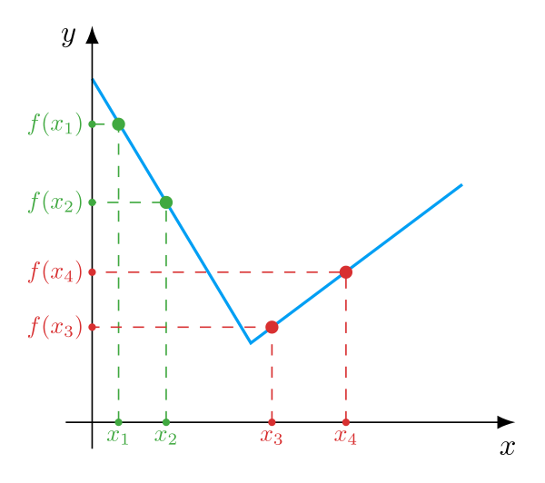
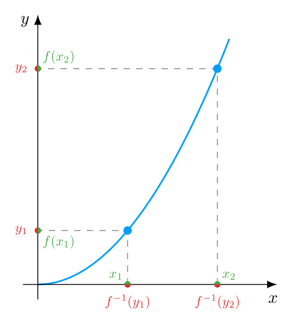

---
{
    "title": "Монотонная функция",
    "desc": "Определяем, что такое возрастающая и убывающая функции. Вводим понятие такое монотонности, изучаем ее свойства. Учимся применять монотонность для решения неравенств и поиска минимумов и максимумов.",
    "tags": ["монотонность", "строгая монотонность", "монотонная функция", "экстремум", "невозрастающая функция", "неубывающая функция", "возрастающая функция", "убывающая функция", "преобразование неравенства"]
}
---

# Монотонная функция

В этой статье мы строго определим понятия возрастающей и убывающей функций.
Введем понятие монотонности и строгой монотонности, изучим ее свойства. Научимся применять монотонность для решения неравенств и поиска минимумов и максимумов.

## Поведение функций {: #intro }

Начем издалека, с рассуждений, которые приведут нас к теме этой статьи. Надо ведь разобраться, как вообще люди пришли к идее возрастающих и убывающих функций, монотонности и почему.

Функция — правило, ставящее числу $x$ в соответствие какое-то значение $y$. Зададимся вопросом, а как вообще может меняться функция?

Для проведения измерений нам нужно взять две разные точки $x_1$ и $x_2$. Для удобства возьмем такие точки, чтобы $x_1 < x_2$, то есть мы как бы переходим от $x_1$ к $x_2$ (слева направо).
Две точки есть. Теперь найдем все возможные варианты изменения функции для этой пары точек:

* $f(x_1) < f(x_2)$ — значение функции **увеличилось**
* $f(x_1) > f(x_2)$ — значение функции **уменьшилось**
* $f(x_1) = f(x_2)$ — значение функции **не изменилось**

<gallery>
    <figure i-src="images/pairs-behaviour/f-pair-increase.svg" caption="Увеличение значения" />
    <figure i-src="images/pairs-behaviour/f-pair-decrease.svg" caption="Уменьшение значения" />
    <figure i-src="images/pairs-behaviour/f-pair-const.svg" caption="Сохранение значения" />
</gallery>

Итак, в самом общем смысле на паре точек функция может измениться лишь тремя перечисленными выше способами.
Ключевой момент — на паре точек $x_1$ и $x_2$. Но поставленный в начале раздела вопрос более общий — нам нужно классифицировать поведение функции в общем на каком-то промежутке!

Судить о поведении функции на промежутке только по ее изменению на двух точках этого промежутка, конечно, нельзя. На иллюстрации ниже приведен наглядный пример, почему так делать нельзя: для пары точек $x_1, x_2$ функция уменьшается, а для пары $x_3, x_4$ увеличивается.

{: .w5 }

Как же тогда быть? А все просто! Нужно смотреть на изменение функции не на конкрентной паре точек, а на **всех** парах $x_1 < x_2$ промежутка.
Тогда, по аналогии со всеми возможными вариантами изменения функции на двух точках, можно выделить все возможные варианты поведения функции на промежутке:

* Возрастание (для всех пар увеличивается)
* Убывание (для всех пар уменьшается)
* Постоянство (для всех пар не меняется)
* Хаос (разные пары имеют разное изменение)

Теперь, когда у нас есть общее представление о типах поведения функций, приступим
к подробному их анализу. Может, этот тернистый и полный опасностей путь выведет нас к интересным и полезным результатам? (спойлер: выведет)

## Возрастающая функция {: #f-increasing }

<gallery>
    <figure i-src="images/increasing.svg" i-class="w8" caption="Возрастающая (неубывающая) функция" />
    <figure i-src="images/increasing-strict.svg" i-class="w8" caption="Строго возрастающая функция" />
</gallery>

Посмотрите на два графика функций выше. У обеих этих функций есть одна общая черта: по мере увеличения аргумента $x$, значения $y$ функции $f(x)$ тоже увеличиваются. Если говорить проще, по мере продвижения по оси $Ox$ вправо, значения функции продвигаются по оси $Oy$ вверх.
Когда функция себя ведет подобным образом, мы говорим, что она "растет" или "возрастает".

Общее понимание есть. Попробуем теперь строго сформулировать, что понимать под "возрастающей" функцией. Для этого мы берем все возможные пары чисел $x_1$ и $x_2$, причем $x_1 < x_2$ и смотрим, в каком отношении находятся значения функции $f(x_1)$ и $f(x_2)$. Если для всех этих пар $x_1 < x_2$ окажется, что и $f(x_1) \leq f(x_2)$, то функцию $f(x)$ называют возрастающей.

{: .w7 }

На картинке выше неравенство $f(x_1) < f(x_2)$ выполняется для первой и последней пар $x_1$ и $x_2$, а для пары в середине выполняется равенство $f(x_1) = f(x_2)$. Принимая во внимание среднюю пару будет очень странно заявлять, что функция "возрастает". Она ведь не меняет свое значение на этом горизонтальном промежутке! Поэтому часто возрастающую функцию называют неубывающей, чтобы подчеркнуть, что она не обязательно растет, но может и просто сохранять свое значение.

<definition>
    Функция $f(x)$ на промежутке $M\subseteq \R$ называется <def>возрастающей</def> или <def>неубывающей</def>, когда для любых двух чисел $x_1, x_2 \in M$ этого промежутка, таких, что $x_1 < x_2$, выполняется неравенство $f(x_1) \leq f(x_2)$.

    $$ \forall x_1, x_2 \in M \ : \ x_1 < x_2 \Rightarrow f(x_1) \leq f(x_2) $$
</definition>

Как мы уже выяснили, неубывающая функция не обязательно "растет". Под это определение попадает и случай, когда она просто не меняет своего значения по мере увеличения $x$.
Если исключить вариант постоянного значения, получим определение для строго возрастающей функции.

<definition>
    Функция $f(x)$ на промежутке $M\subseteq \R$ называется <def>строго возрастающей</def>, когда для любых двух чисел $x_1, x_2 \in M$ этого промежутка, таких, что $x_1 < x_2$, выполняется неравенство $f(x_1) < f(x_2)$.

    $$ \forall x_1, x_2 \in M \ : \ x_1 < x_2 \Rightarrow f(x_1) < f(x_2) $$
</definition>

Хочу еще раз обратить внимание, что в обоих определениях мы говорим о всех возможных парах $x_1, x_2$, таких что $x_1 < x_2$. Мы смотрим на все такие пары потому что нас интересует поведение функции на всем промежутке. Если в промежутке найдется хотя бы одна пара $x_1' < x_2'$ для которой выполняется $f(x_1') > f(x_2')$ (значение функции для этой пары уменьшится), то мы уже не можем говорить о "росте" функции на промежутке. Действительно, как о каком росте на промежутке может идти речь, если мы в нем нашли пару, для которой функция уменьшилась. Это важно понимать.

<example id="monotonic-up" title="Исследование на неубывание/строгое возрастание">
    <task>
        Выяснить, являются ли следующие функции неубывающими или строго возрастающими:
        $$ \text{а) } f(x) = x \qquad \text{б) } f(x) = 2 \qquad \text{в) } f(x) = x^2 \qquad \text{г) } f(x) = \sqrt{x} $$
    </task>
    <solution>
        **Пункт а)**
        Берем две произвольные точки $x_1$ и $x_2$, такие что $x_1 < x_2$. Раз $f(x) = x$, то получаем следующую ситуацию:

        $$ x_1 = f(x_1) < x_2 = f(x_2) $$

        $$ f(x_1) < f(x_2) $$

        Это по определению означает, что функция $f(x) = x$ является строго возрастающей на всей своей области определения $(-\infty, +\infty)$.

        **Пункт б)**
        Функция $f(x) = 2$ при любом $x$ равна $2$. Значит, для любых пар $x_1$ и $x_2$ вида $x_1 < x_2$ значения функции будут равны:

        $$ f(x_1) = f(x_2) = 2 $$

        Это по определению означает, что функция $f(x) = 2$ неубывает на всей области определения $(-\infty, +\infty)$.

        **Пункт в)**
        Представляем график обычной параболы и замечаем, что функция $x^2$ не является возрастающей на всей своей области определения. Для доказательства этого достаточно взять $x_1 = -1$ и $x_2 = 0$. Найдем значения функции для этих точек:

        $$ f(x_1) = x_1^2 = (-1)^2 = 1 \\ f(x_2) = x_2^2 = 0^2 = 0 \\ f(x_1) > f(x_2) $$

        Итак, мы нашли такую пару точек, при которых значение функции уменьшилось. Значит, нельзя говорить, что $f(x) = x^2$ является неубывающей или строго возрастающей функцией на всей своей области определения $(-\infty, +\infty)$.

        Попробуем для этой же функции рассмотреть только неотрицательные $x$. Вновь возьмем произвольную пару уже неотрицательных чисел $0 \leq x_1 < x_2$. Попробуем доказать, что:

        $$ f(x_1) < f(x_2) \\ x_1^2 < x_2^2 \\ 0 < x_2^2 - x_1^2 \\ 0 < (x_2 - x_1)(x_2 + x_1) $$

        Первая скобка $x_2 - x_1$ будет положительной, так как по условию $x_1 < x_2$. Вторая скобка всегда положительная, так как в ней находится сумма двух положительных чисел. Произведение двух положительных чисел есть число
        положительное, поэтому последнее неравенство выполняется.

        Итак, мы по определению доказали, что квадратичная функция $x^2$ строго возрастает на полуинтервале $[0, +\infty)$.

        **Пункт г)**
        Сразу напомню, что квадратный корень от отрицательных чисел мы взять не можем, поэтому областью определения функции $\sqrt{x}$ является все неотрицательные числа, то есть $[0, +\infty)$. Берем две произвольные точки $x_1 < x_2$ из этой области. Для строгой монотонности нам нужно доказать, что

        $$ f(x_1) < f(x_2) \\ \sqrt{x_1} < \sqrt{x_2} $$

        Выпишем последнее неравенство дважды. В первом обе части умножим на $\sqrt{x_1}$, во втором на $\sqrt{x_2}$:

        $$ \sqrt{x_1} < \sqrt{x_2} \ \qquad \ \sqrt{x_1} < \sqrt{x_2} \\ \sqrt{x_1}^2 < \sqrt{x_1}\sqrt{x_2} \ \qquad \ \sqrt{x_1}\sqrt{x_2} < \sqrt{x_2}^2 $$
        
        $$ \sqrt{x_1}^2 < \sqrt{x_1}\sqrt{x_2} < \sqrt{x_2}^2 \\ \sqrt{x_1}^2 < \sqrt{x_2}^2 \\ x_1 < x_2 $$

        Ну а последнее выполняется по условию, ведь мы как раз и взяли такие $x_1$ и $x_2$, что $x_1 < x_2$. Итак, мы по определению доказали, что функция $\sqrt{x}$ строго возрастает на всей своей области определения $[0, +\infty)$.
    </solution>
</example>

Наконец, установим достаточно очевидную связь между двумя введенными определениями с помощью следующего свойства:

<theorem title="Связь между неубывающей и строго возрастающей функциями">
    <statement>Любая строго возрастающая функция является неубывающей.</statement>
    <proof>
        Пусть нам дана произвольная строго убывающая функция $f(x)$. Опуская повторяющиеся части определений, сразу перейдем к сути, а именно:

        $$ f(x_1) < f(x_2) $$

        По определению неравенство с символом "больше или равно" $\leq$ выполняется в двух случаях: когда имеет место равенство $=$ или строгое неравенство $<$.
        
        В случае с $f(x)$ имеет место случай строгого неравенства, а значит, по только что приведенному определению, выполняется и нестрогое неравенство:

        $$ f(x_1) \leq f(x_2) $$

        А это выполнение нестрогого неравенства уже по определению означает, что функция $f(x)$ является неубывающей.

        $\blacksquare$
    </proof>
</theorem>

## Убывающая функция {: #f-decreasing }

<gallery>
    <figure i-src="images/decreasing.svg" i-class="w8" caption="Убывающая (невозрастающая) функция" />
    <figure i-src="images/decreasing-strict.svg" i-class="w8" caption="Строго убывающая функция" />
</gallery>

Похожие рассуждения из предыдущего раздела можно провести и для обратного случая. На рисунке выше изображены две функции. Замечаем, что при увеличении аргумента $x$, значения $y$ функции $f(x)$ уменьшаются.
Визуально, по мере движения по оси $Ox$ вправо, значения функции "падают" вниз по оси $Oy$. Когда функция ведет себя подобным образом, мы говорим, что она "убывает". Сформулируем теперь строгие определения:

<definition>
    Функция $f(x)$ на промежутке $M\subseteq \R$ называется <def>убывающей</def> или <def>невозрастающей</def>, когда для любых двух чисел $x_1, x_2 \in M$ этого промежутка, таких, что $x_1 < x_2$, выполняется неравенство $f(x_1) \geq f(x_2)$.

    $$ \forall x_1, x_2 \in M \ : \ x_1 < x_2 \Rightarrow f(x_1) \geq f(x_2) $$
</definition>

<definition>
    Функция $f(x)$ на промежутке $M\subseteq \R$ называется <def>строго убывающей</def>, когда для любых двух чисел $x_1, x_2 \in M$ этого промежутка, таких, что $x_1 < x_2$, выполняется неравенство $f(x_1) > f(x_2)$.

    $$ \forall x_1, x_2 \in M \ : \ x_1 < x_2 \Rightarrow f(x_1) > f(x_2) $$
</definition>

Легко видеть, что эти определения отличаются от определений небывающей и строго возрастающей функций только направлением знака неравенства для значений функции.

<example id="monotonic-down" title="Исследование на невозрастание/строгое убывание">
    <task>
        Выяснить, являются ли следующие функции невозрастающими или строго убывающими:
        $$ \text{а) } f(x) = -x \qquad \text{б) } f(x) = 2 \qquad \text{в) } f(x) = x^2 \qquad \text{г) } f(x) = \frac{1}{x} $$
    </task>
    <solution>
        Во всех пунктах, кроме последнего, ход доказательства аналогичен доказательствам в <e:[примере](monotonic-up)> на неубывание.

        **Пункт а)**
        Функция $f(x) = -x$ строго убывает на всей своей области определения $(-\infty, +\infty)$.

        **Пункт б)**
        Функция $f(x) = 2$ невозрастает на всей области определения $(-\infty, +\infty)$.

        **Пункт в)**
        Функция $f(x) = x^2$ строго убывает на отрицательной полуоси $(-\infty, 0]$.

        **Пункт г)**
        Рассмотрим произвольные положительные $x_1$ и $x_2$, такие, что

        $$ x_1 < x_2 $$

        Делим обе части неравенства на $x_1$.

        $$ 1 < \frac{x_2}{x_1} $$

        Теперь делим обе части неравенства на $x_2$:

        $$ \frac{1}{x_2} < \frac{1}{x_1} $$

        Это по определению означает, что для положительных $x$ функция $\frac{1}{x}$ строго убывает.
    </solution>
</example>

Конечно, два введенных в этом разделе определения связаны друг с другом точно так же, как связаны два определения из предыдущего:

<theorem title="Связь между невозрастающей и строго убывающей функциями">
    <statement>Любая строго убывающая функция является невозрастающей.</statement>
    <proof>
        Доказательство проводится аналогичным образом.
    </proof>
</theorem>

## Понятие монотонности {: #f-monotonic }

Итак, у нас есть 4 разных определения: невозрастающая, неубывающая, строго возрастающая и строго убывающая функция.
Все эти определения похожи друг на друга в том смысле, что их выполнение означает конкретные характеры (тенденции) развития функции, о чем мы и говорили в начале статьи.

Раз определения похожи друг на друга, то имеет смысл придумать какое-то общее название для них. Именно тут в игру вступает понятие "монотонность", что в расшифровке означает "моно-" (один) "-тон" (характер).

<definition id="f-monotonic">
    <def>Монотонная функция</def> — неубывающая или невозрастающая функция.
</definition>

<definition>
    <def>Строго монотонная функция</def> — строго возрастающая или строго убывающая функция.
</definition>

Так как любая строго возрастающая/убывающая функция является неубывающей/невозрастающей, то и любая строго монотонная функция по определению будет являться монотонной. Короче говоря, **монотонная функция** — самое общее понятие, которым можно назвать функцию если она неубывающая, или невозрастающая, или строго возрастающая, или строго убывающая.

Итак, функцию мы называем монотонной на каком-то промежутке, если она на этом промежутке имеет один характер, одно поведение.

Исследуем на монотонность несколько распространенных функций:

<example id="f-const" title="Монотонность константной функции">
    <task>
        Исследуйте на монотонность функцию $f(x) = C$, которая при любом $x$ принимает одно и то же значение $C$.
        Докажите, что эта функция является одновременно неубывающей и невозрастающей.
    </task>
    <solution>
        Возьмем два произвольных числа $x_1$ и $x_2$, такие, что $x_1 < x_2$. Тогда $f(x_1) = f(x_2) = C$, а значит одновременно выполняются два неравенства:

        $$ f(x_1) = C \leq C = f(x_2) \\ f(x_1) = C \geq C = f(x_2)  $$

        Это по определению означает, что константная функция $f(x)$ является одновременно неубывающей и невозрастающей.

        На самом деле, этот факт достаточно очевидный. График любой константной функции представляет собой горизонтальную прямую. Значит, про любую такую функцию можно сказать, что она одновременно не растет и не убывает.
        Другими словами, как может расти/убывать, то есть меняться то, что по определению не меняется?
    </solution>
</example>

<example id="abs-monotonic" title="Монотонность модуля">
    <task>
        Исследуйте на монотонность функцию модуля $f(x) = |x|$.
    </task>
    <solution>
        По <d:[определению](/algebra/abs/abs-function)> функции модуля:

        $$ |x| = \begin{cases} \phantom{-}x, \quad x \geq 0 \\ -x, \quad x < 0 \end{cases} $$

        Итак, функция модуля при отрицательных $x$ равна $-x$. В <e:[исследовании на убывание](monotonic-down)> мы уже выяснили, что функция $-x$ строго убывает.
        Значит, функция модуля на промежутке $(-\infty, 0)$ строго убывает. Число $0$ также можно включить в этот промежуток, ведь $|0| = 0$, что меньше любого другого значения функции модуля.
        Поэтому можно говорить, что функция модуля строго убывает на промежутке $(-\infty, 0]$.

        При положительных $x$ и при $0$ функция модуля равна $x$. В <e:[исследовании на возрастание](monotonic-up)> мы выяснили, что функция $x$ строго возрастает. Значит, функция модуля на промежутке $[0, +\infty)$ строго возрастает.

        Подведем итог. Функция модуля $|x|$ строго убывает на промежутке $(-\infty, 0]$ и строго возрастает на промежутке $[0, +\infty)$.
    </solution>
</example>

### Свойства монотонных функций {: #monotonic-properties }

Выясним, при каких действиях с произвольными монотонными функциями они сохраняют свою монотонность. Будем называть две функции функциями одного "характера", если они обе неубывают или невозрастают.

<theorem id="monotonic-sum" title="Сумма монотонных функций">
    <statement>
        Сумма двух монотонных функций одного характера есть монотонная функция такого же характера. Причем если одна из функций строго монотонна, то и сумма будет строго монотонной.

        **Следствие:** прибавление к функции константы не влияет на монотонность результата.
    </statement>
    <proof>
        Доказывать будем для неубывающих функций. Доказательство для невозрастающих проводится аналогично.

        Пусть $f(x)$ и $g(x)$ — неубывающие функции. По определению, для любых $x_1 < x_2$ это означает выполнение двух неравенств:

        $$ f(x_1) \leq f(x_2) \qquad g(x_1) \leq g(x_2) $$

        К неравенству слева с обеих сторон прибавим $g(x_1)$:

        $$ f(x_1) + g(x_1) \leq f(x_2) + g(x_1) $$

        Ко неравенству справа с обеих сторон прибавим $f(x_2)$:

        $$ f(x_2) + g(x_1)\leq g(x_2) + f(x_2) $$

        Получаем цепное неравенство

        $$ f(x_1) + g(x_1) \leq g(x_1) + f(x_2) \leq f(x_2) + g(x_2) $$
    
        Опускаем уже ненужное звено в середине и получаем, что

        $$ f(x_1) + g(x_1) \leq f(x_2) + g(x_2) $$

        Это по определению означает, что сумма $f(x) + g(x)$ является неубывающей функцией.

        $\blacksquare$

        Если одна из функций строго монотонна, то в полученном цепном неравенстве будет знак строгого неравенства, а значит и финальное неравенство тоже окажется строгим.

        Константу можно представить в виде константной функции. Как мы уже выяснили в <e:[примере](f-const)> выше, любая константная функция одновременно является невозрастающей и одновременно неубывающей.
        А значит, мы можем взять нужное нам выполняющее определение и воспользоваться только что доказанным свойством.
    </proof>
</theorem>

<theorem id="monotonic-multi" title="Произведение монотонных функций">
    <statement>
        Произведение двух положительных монотонных функций одного характера есть монотонная функция такого же характера. Причем если одна из функций строго монотонна, а вторая не равна $0$, то и произведение будет строго монотонным.

        **Следствие:** умножение монотонной функции на $-1$ меняет ее характер результата на противоположный. 
    </statement>
    <proof>
        Доказывать будем для двух положительных неубывающих функций. Доказательство для невозрастающих проводится аналогично.

        Пусть $f(x)$ и $g(x)$ — неубывающие положительные функции. По определению, для любых пар $x_1$ и $x_2$, таких, что $x_1 < x_2$ выполняются два неравенства:

        $$ f(x_1) \leq f(x_2) \qquad g(x_1) \leq g(x_2) $$

        Левое неравенство умножим на положительное $g(x_1)$, а правое на $f(x_2)$:

        $$ f(x_1)g(x_1) \leq f(x_2)g(x_1) \qquad f(x_2)g(x_1) \leq f(x_2)g(x_2) $$
        
        $$ f(x_1)g(x_1) \leq f(x_2)g(x_1) \leq f(x_2)g(x_2) $$

        $$ f(x_1)g(x_1) \leq f(x_2)g(x_2) $$

        Это по определению означает, что произведение $f(x)g(x)$ является неубывающей функцией.

        $\blacksquare$

        Следствие выполняется, потому что при умножении на $-1$ знак неравенства меняется на противоположный. Например, при умножении на $-1$ неравенство из определения неубывающей функции $f(x)$ получим:

        $$ f(x_1) \leq f(x_2) $$

        $$ -f(x_1) \geq -f(x_2) $$

        Это по определению означает, что функция $-f(x)$ невозрастающая.
    </proof>
</theorem>

С помощью этих теорем можно изучать на монотонность громоздкие сложные функции, изучая монотонность их отдельных частей.

<example title="Монотонность линейной функции" dodem="221.а">
    <task>
        Исследуйте монотонность линейной функции общего вида:

        $$ f(x) = Ax + B $$
    </task>
    <solution>
        Константа $B$ <t:[не влияет](monotonic-sum)> на монотонность $f(x)$, поэтому ее можно отбросить.
        Остается только $Ax$. Выше мы <e:[выяснили](monotonic-up)>, что функция $x$ строго возрастает на всей своей области определения.
        Значение константы $A$ на монотонность <t:[не влияет](monotonic-multi)> (при условии, что $A\neq 0$). На нее влияет только знак этой константы.

        Итак, если $A > 0$, то функция $Ax + B$ строго возрастает на $(-\infty, +\infty)$. Если $A < 0$, то строго убывает.
    </solution>
</example>

<example title="Монотонность квадратичной функции" dodem="221.б">
    <task>
        Исследуйте монотонность квадратичной функции общего вида:

        $$ f(x) = Ax^2 + Bx + C $$
    </task>
    <solution>
        Сразу выбрасываем константу $C$ в окно, так как она <t:[не влияет](monotonic-sum)> на монотонность $f(x)$.
        В оставшемся выражении вынесем $A$ за скобки и выделим полный квадрат:

        $$ Ax^2 + Bx = A\left[ x^2 + \frac{B}{A}x \right] = A\left[ x^2 + 2\frac{B}{2A}x + \left(\frac{B}{2A}\right)^2 - \left( \frac{B}{2A} \right)^2 \right] = \\[10px] = A\left( x + \frac{B}{2A} \right)^2 - \frac{B^2}{4A} $$

        Скобку обозначим за $t$, а $-\frac{B^2}{4A}$ за $C'$:
        
        $$ At^2 + C' $$

        Константа $C'$ <t:[не влияет](monotonic-sum)> на монотонность, поэтому можно ее отбросить.

        Остается функция $At^2$. Функция $t^2$, как мы выяснили в предыдущих упражнениях (<e:[1](monotonic-up)> и <e:[2](monotonic-down)>), строго убывает при $t \in (-\infty, 0]$ и строго возрастает при $t \in [0, +\infty)$.

        Перейдем от $t$ обратно к $x$. У нас есть два промежутка для $t$: $(-\infty, 0]$ и $[0, +\infty)$. Оба этих промежутка можно представить в виде двух неравенств:

        $$ t\in(-\infty, 0] \qquad \qquad t\in[0, +\infty) \\[5px] t \leq 0 \qquad \qquad t \geq 0 \\[5px] x+\frac{B}{2A} \leq 0 \qquad \qquad x + \frac{B}{2A} \geq 0 \\[5px] x \leq -\frac{B}{2A} \qquad \qquad x \geq -\frac{B}{2A} $$

        Выяснили, что функция $\left(x + \frac{B}{2A}\right)^2$ строго убывает на промежутке $\left(-\infty, -\frac{B}{2A}\right]$ и строго возрастает на $\left[ -\frac{B}{2A}, +\infty \right)$.

        Итак, мы свели вопрос о монотонности функции $Ax^2 + Bx + C$ к монотонности функции

        $$ A\left( x + \frac{B}{2A} \right)^2 $$

        Будем считать, что $A\neq 0$, так как в противном случае из квадратинчой функции получим линейную. Если константа $A$ положительная, то она <t:[не повлияет](monotonic-multi)> на монотонность. Если отрицательная — монотонность <t:[изменится](monotonic-multi)> на противоположную.

        Подведем итог. Если $A > 0$, то функция $Ax^2 + Bx + C$ строго убывает на промежутке $\left(-\infty, -\frac{B}{2A}\right]$ и строго возрастает на $\left[ -\frac{B}{2A}, +\infty \right)$. Если $A < 0$, то все наоборот.
    </solution>
</example>

### Немонотонная функция {: #no-monotonic }

Иногда бывает полезно воспользоваться отрицанием монотонности функции, то есть ее немонотонностью.

Из <d:[определения](f-monotonic)> мы знаем что функцию называют монотонной, если она является неубывающей или невозрастающей, то есть:

$$ \forall x_1, x_2 \ : \ x_1 < x_2 \Rightarrow f(x_1) \leq f(x_2) \\ \text{или} \\ \forall x_3, x_4 \ : \ x_3 < x_4 \Rightarrow f(x_3) \geq f(x_4) $$

Если мы берем отрицание этого определения, то мы отрицаем выражение выше. Результат:

$$ \exists x_1, x_2 \ : \ x_1 < x_2 \text{ и } f(x_1) > f(x_2) \\ \text{и} \\ \exists x_3, x_4 \ : \ x_3 < x_4 \text{ и } f(x_3) < f(x_4) $$

На человеческом языке это означает, что найдутся две пары $x_1 < x_2$ и $x_3 < x_4$ такие, что на первой функция уменьшится, а на второй — увеличится.
Введем теперь определение немонотонной функции:

<definition>
    Функция $f(x)$ на промежутке $M\subseteq \R$ называется <def>немонотонной</def>, если существуют две пары чисел $x_1, x_2 \in M$ и $x_3, x_4 \in M$, таких, что $x_1 < x_2$ и $x_3 < x_4$, и на первой паре функция возрастает, а на второй — убывает:

    $$ f(x_1) < f(x_2) \qquad f(x_3) > f(x_4) $$
</definition>

## Связь с обратной функцией {: #inverse-f-connection }

<cross title="Обратное отношение" />

Мы выяснили, что монотонность функции означает наличие у нее некоторой закономерности или "характера" роста.
Встает интересный вопрос: а влияет ли монотонность исходной функции на поведение обратной функции? Попробуем проверить!

{: .w6 }

На иллюстрации выше изображена строго возрастающая функция. Факт ее строгого возрастания выражен зеленой парой точек $x_1 < x_2$, для значений которых, как видим, выполняется неравенство $f(x_1) < f(x_2)$.
Замечаем, что и для пары красных точек $y_1 < y_2$ на оси ординат соответствующие значения обратной функции находятся в том же отношении $f^{-1}(y_1) < f^{-1}(y_2)$ (для лучшего восприятия можете наклонить голову вправо)!

Похоже, строгая монотонность исходной функции сохраняется и для обратной функции. Докажем этот факт.

<theorem id="monotonic-inverse" title="Теорема о монотонности обратной функции">
    <statement>Если функция $f$ строго возрастает (убывает), то существует обратная ей функция $f^{-1}$, которая тоже строго возрастает (убывает).</statement>
    <proof>
        Доказывать будем для строго возрастающей функции. Доказательство для строго убывающей аналогичное.

        Сначала докажем, что обратная функция $f^{-1}$ вообще существует. Для этого покажем, что исходная функция $f$ взаимно-однозначна, то есть для любых двух неравных $x_1$ и $x_2$ соответствующие значения функции $f(x_1)$ и $f(x_2)$ тоже не равны:

        $$ \forall x_1, x_2 \ : \ x_1 \neq x_2 \Rightarrow f(x_1) \neq f(x_2) $$

        Докажем от противного. Пусть существуют такие два неравных числа $x_1'$ и $x_2'$, значения функции для которых равны: $f(x_1') =  f(x_2')$. Раз $x_1' \neq x_2'$, то возможны лишь два варианта: либо $x_1' < x_2'$, либо $x_1' > x_2'$.

        Если выполняется $x_1' < x_2'$, то, по определению строго возрастающей функции должно выполнятся неравенство $f(x_1') < f(x_2')$. Но по предположению от противного у нас выполняется равенство $f(x_1') =  f(x_2')$! Получили противоречие.
        Аналогично, если выполняется $x_2' < x_1'$, то должно выполняться $f(x_2') < f(x_1')$, что опять приводит к противоречию.

        Итак, в обоих возможных вариантах получили противоречие. Мы доказали, что строго возрастающая функция $f$ взаимо-однознача. Но любая взаимо-однозначная функция имеет обратную функцию, поэтому и строго возрастающая функция $f$ имеет обратную функцию $f^{-1}$.

        <todo>Когда будет написана статья "Обратное отношение", привести ссылку на тот факт, что взаимо-однозначность и наличие обратной функции есть одно и то же.</todo>

        Теперь докажем, что $f^{-1}$ тоже строго возрастает, то есть:
        
        $$ \forall y_1,y_2 \ : \ y_1 < y_2 \Rightarrow f^{-1}(y_1) < f^{-1}(y_2) $$

        Докажем от противного. Пусть существуют два таких $y_1' < y_2'$, для которых $f^{-1}(y_1') \geq f^{-1}(y_2')$. Последнее означает два варианта:

        $$ f^{-1}(y_1') = f^{-1}(y_2') \qquad \qquad f^{-1}(y_1') > f^{-1}(y_2') $$

        В случае равенства получаем, что **разные** числа $y_1'$ и $y_2'$ получаются из **одного** $x'$, то есть $f(x')$ имеет два разных значения: $y_1'$ и $y_2'$, а это означает, что $f$ вообще не является функцией по определению. Противоречие.

        Рассмотрим случай $f^{-1}(y_1') > f^{-1}(y_2')$. Мы знаем, что $f^{-1}(y_1') = x_1'$ и $f^{-1}(y_2') = x_2'$, причем $x_1'$ и $x_2'$ принадлежат области определения $f$. Получили пару $x_1' > x_2'$. По определению строго возрастающей $f$ должно
        выполняться неравенство:

        $$ y_1' = f(x_1') > f(x_2') = y_2' \\[5px] y_1' > y_2' $$

        Вновь получили противоречие. Итак, оба варианта приводят к противоречию. Значит, функция $f^{-1}$ все же является строго возрастающей.

        $\blacksquare$
    </proof>
</theorem>

Согласно доказанной теореме, любая строго монотонная функция имеет строго монотонную обратную функцию.
Приведем несколько широко известных примеров:

$$
    \def\arraystretch{1.5}
    \begin{array}{|c|c|}
        \hline
        f(x) & f^{-1}(x) \\ \hline
        x^2 & \sqrt{x} \\
        \hdashline
        a^x & \log_a x \\
        \hdashline
        \sin x & \arcsin x \\
        \hdashline
        \cdots & \cdots \\
        \hline
    \end{array}
$$

Еще эта теорема очень полезна тем, что она позволяет применять строгую монотонность для преобразований неравенств, о чем мы поговорим далее.

## Применение монотонности {: #usage }

Мы уже пониманием, что монотонность сама по себе является важной характеристикой поведения функции.
Знать, как ведет себя функция (убывает/возрастает), конечно, познавательно, но можно ли извлечь из этого знания какую-то практическую пользу? Как можно применить это знание?

### Преобразования неравенств {: #usage-ineq }

Возьмем два числа: $3$ и $5$ и неубывающую функцию $f(x) = 2$. Согласно определению мы можем записать следующее:

$$ 3 < 5 \Rightarrow f(3) \leq f(5) $$

$$ 3 < 5 \Rightarrow 2 \leq 2 $$

Заметьте, что "переход" слева направо совершенно правилен и не может привести к ошибке.
А вот в обратную сторону "проходить" ни в коем случае нельзя!
Согласитесь, что неравенство $2 \leq 2$ вообще мало о чем говорит, и уж тем более из него никак не следует $3 < 5$.
Итак, законно перейдя от $3 < 5$ к $2\leq 2$ мы потеряли обратную связь.

В общем случае, когда мы в неравенстве $a < b$ от обеих частей берем **нестрого** монотонную функцию $f(x)$ и получаем, например, $f(a) \leq f(b)$, то
наше преобразование работает только "слева-направо". Другими словами, из полученного действительно выполняющегося неравенства $f(a) \leq f(b)$ нельзя делать никаких выводов о изначальном неравенстве $a < b$!

А вот со строго мнотонными функциями ситуация совершенно иная.
Докажем следующую очень полезную теорему:

<theorem id="f-ineq" title="Теорема об эквивалентном преобразовании неравенств">
    <statement>
        Пусть $f(x)$ — строго монотонная функция.
        Пусть $u$ и $v$ — числа из области определения $f(x)$.
        В общем случае $u$ и $v$ — произвольные функции, которые вместе с $f(x)$ определены на общем множестве $M$ (область допустимых значений, ОДЗ).

        Если $f(x)$ строго возрастает, то

        $$ u < v \Leftrightarrow f(u) < f(v) \qquad \quad u \leq v \Leftrightarrow f(u) \leq f(v) $$

        Если $f(x)$ строго убывает, то

        $$ u < v \Leftrightarrow f(u) > f(v) \qquad \quad u \leq v \Leftrightarrow f(u) \geq f(v) $$
    </statement>
    <proof>
        Докажем для строго возрастающей функции. Доказательство для строго убывающей аналогичное.

        Пусть $u$ и $v$ это два числа из области определения $f(x)$, такие, что $u < v$. Тогда, по определению строго возрастающей функции $f(x)$ выполняется следствие:

        $$ u < v \Rightarrow f(u) < f(v) $$

        По <t:[теореме](monotonic-inverse)> о монотонности обратной функции у функции $f$ на можестве $M$ есть строго возрастающая обратная функция $f^{-1}$. Тогда для любой пары значений функции $f$, в том числе
        и для пары $f(u) < f(v)$ по определению строго возрастающей функции $f^{-1}$ будет выполняться следствие

        $$ f(u) < f(v) \Rightarrow f^{-1}\left( f(u) \right) < f^{-1}(f(v)) $$

        Принимая во внимание тот факт, что $f^{-1}(f(u)) = u$ и $f^{-1}(f(v)) = v$ получаем, что

        $$ f(u) < f(v) \Rightarrow u < v $$

        Вот мы и доказали эквивалентность:

        $$ u < v \Leftrightarrow f(u) < f(v) $$

        В случая нестрогого неравенства можно провести следующие действия:

        $$ u\leq v \Leftrightarrow \orcases{ u = v \Leftrightarrow f(u) = f(v) \\[5px] u < v \Leftrightarrow f(u) < f(v) } \Leftrightarrow f(u) \leq f(v) $$

        Как видите, мы воспользовались определением знака $\leq$ и разбили его на два возможных варианта: равенство или строгое неравенство. Строгое неравенство мы уже разобрали выше. С равенством тоже все очевидно.
        Действительно, если $u$ и $v$ есть одно и то же число, то и значения функции от двух одинаковых чисел тоже будут совпадать (в противном случае $f$ не является функцией по определению).
        Теперь наоборот. Два значения функции $f(u)$ и $f(v)$ равны друг другу. Значит и значения обратной функции $f^{-1}(f(u)) = u$ и $f^{-1}(f(v)) = v$ от этих одинаковых чисел тоже должны быть одинаковыми (в противном случае $f^{-1}$ не является функцией по определению).

        Если $u$ и $v$ — функции, то рассуждения выше можно провести для произвольных двух чисел $u', v' \in M$, таких, что $u' < v'$.

        $\blacksquare$
    </proof>
</theorem>

Если говорить простым языком, то по теореме выше, применение строго монотонной функции к неравенству не разрывает связь между исходным и полученным неравенствами, то есть все проведенные дейсвтия можно выполнить "в обратную сторону".
Вот так это можно использовать:

<example title="Сравнение чисел">
    <task>
        Какое число больше: $2\sqrt{5}$ или $3\sqrt{3}$?
    </task>
    <solution>
        Итак, нам нужно найти верный знак неравенства между двумя числами:

        $$ 2\sqrt{5} \quad \text{?} \quad 3\sqrt{3} $$

        Зная, что на положительных числах функция $x^2$ строго возрастает, мы можем применить ее к обеим частям неравенства, то есть
        "возвести их в квадрат":

        $$ (2\sqrt{5})^2 = 4\cdot 5 = 20 \quad \text{?} \quad (3\sqrt{3})^2=9\cdot3=27 \\ 20 < 27 $$

        С логической точки зрения мы совершили следующий переход:

        $$ 2\sqrt{5} \quad \text{?} \quad 3\sqrt{3} \quad \overset{\footnotesize x^2}{\Rightarrow} \quad 20 < 27 $$

        Но по доказанной <t:[теореме](f-ineq)> выше справедлив и обратный переход, благодаря которому мы и получаем искомый знак неравенства:

        $$ 20 < 27 \quad \overset{\footnotesize \sqrt{x}}{\Rightarrow} \quad 2\sqrt{5} < 3\sqrt{3} $$

        Итак, число $3\sqrt{3}$ больше числа $2\sqrt{5}$.
    </solution>
</example>

<example title="Цепочка преобразований">
    <task>
        Докажите, что среднее арифметическое двух чисел всегда не меньше, чем их среднее геометрическое, то есть для любых положительных $a$ и $b$ выполняется неравенство:

        $$ \frac{a+b}{2} \geq \sqrt{ab} $$
    </task>
    <solution>
        Так как оба числа $a$ и $b$ у нас положительные, то обе части доказываемого неравенства всегда будут положительными.
        Значит, мы вновь можем воспользоваться строго возрастающей на положительных числах функцией $x^2$, или, если говорить простым языком, "возвести в квадрат" обе части неравенства:

        $$ \frac{a+b}{2} \geq \sqrt{ab} \\[5px] \frac{(a+b)^2}{4} \geq ab $$

        Дальше проводим элементарные преобразования над получившимся результатом:

        $$ a^2 + 2ab + b^2 \geq 4ab \\[5px] a^2 - 2ab + b^2 \geq 0 \\[5px] (a-b)^2 \geq 0 $$

        Последнее неравенство выполняется всегда, так как квадрат любого числа есть неотрицательное число.

        Наши рассуждения выше можно изобразить как-то так:

        $$ \frac{a+b}{2} \geq \sqrt{ab} \ \Leftrightarrow \ \ldots \ \Leftrightarrow \ (a-b)^2 \geq 0, $$
        
        где под троеточием идут эквивалентные преобразования. Все эти промежуточные рассуждения можно опустить, оставив лишь первый и последний эквивалентные результаты:

        $$ \frac{a+b}{2} \geq \sqrt{ab} \ \Leftrightarrow \ (a-b)^2 \geq 0 $$

        Раз выполняется правое неравенство, значит выполняется и левое:

        $$ \frac{a+b}{2} \geq \sqrt{ab} $$

        $\blacksquare$
    </solution>
</example>

<important>
    Знак эквивалентности "сохраняет" и неправильный результат тоже.
    Этим можно пользоваться при доказательствах от противного или проверки своих гипотез. Например, проверим, верно ли, что $\sqrt{2} > \sqrt{3}$. Для этого вновь воспользуемся функцией $x^2$:

    $$ \sqrt{2} > \sqrt{3} \ \Leftrightarrow \ 2 > 3 $$

    В результате получили очевидно неверный результат: $2 > 3$. Значит и наше исходное неравенство тоже неверно.
</important>

### Минимумы и максимумы {: #usage-min-max }

У монотонности есть еще одно кране полезное применение — с ее помощью можно быстро находить минимумы и максимумы функций.

Действительно, раз функция постоянно растет на каком-то отрезке, интуитивно понятно, что по мере движения по отрезку ее значения не могут оказаться меньше, чем в его начале. То есть, в начале отрезка она будет иметь минимальное значение, а в конце — максимальное.
Аналогично, если нам известно, что функция убывает, то в "начале пути" она будет иметь максимальное значение, "по ходу" значения будут только уменьшаться, а в конце примет минимальное значение.

Выразим эту мысль в виде строгой теоремы:

<theorem id="monotonic-min-max" title="Теорема о минимумах и максимумах">
    <statement>
        Если функция $f(x)$ неубывает на отрезке $[a,b]$, то в точке $a$ она принимает наименьшее значение, а в точке $b$ — наибольшее.
        Аналогично, невозрастающая функция в $a$ имеет максимум, а в $b$ — минимум.

        В случае строгой монотонности точки $a$ и $b$ становятся единственными на отрезке, в которых $f(x)$ принимает минимальное/максимальное значения.
    </statement>
    <proof>
        Докажем, что неубывающая на $[a,b]$ функция $f(x)$ в точке $a$ имеет минимальное значение.

        Возьмем произвольную точку $t$ отрезка $[a,b]$, притом $a\neq t$. Точка $t$ не может быть меньше $a$, иначе она просто не попадет в отрезок $[a,b]$.
        Поэтому остается единственный вариант: $a < t$. По определению неубывающей функции это означает, что выполняется неравенство:

        $$ f(a) \leq f(t) $$

        Вот и получается, что на всех точках отрезка $[a,b]$ (кроме самой $a$) значения функции будут не меньше $f(a)$, а это по определению и означает, что в точке $a$ функция $f(x)$ принимает наименьшее значение.

        $\blacksquare$

        Но не факт, что точка $a$ единственная, в которой $f(x)$ имеет минимум.
        А вот если функция строго возрастает, то для любой точки $t$ отрезка получим $f(a) < f(t)$, что означает, что $a$ является не просто минимумом, а единственным минимумом на отрезке $[a,b]$.

        Доказательства для точки $b$, а также для невозрастающей функции проводятся аналогично.
    </proof>
</theorem>

Опробуем эту теорему на паре примеров:

<example>
    <task>
        Найдите минимум и максимум (если они имеются) следующей функции:
        
        $$ f(x) = 3|x| - 100 $$
    </task>
    <solution>
        Ранее мы уже <e:[изучили](abs-monotonic)> функцию модуля на монотонность. Модуль строго убывает на $(-\infty, 0]$ и строго возрастает на $[0, +\infty)$.

        В нашем примере сначала $|x|$ умножается на $3$. По теореме о произведении монотонных функций получаем функцию $3|x|$, которая все также строго убывает на $(-\infty, 0]$ и строго возрастает на $[0, +\infty)$.

        Далее к $3|x|$ мы прибавляем константу $-100$. По следствию теоремы о сумме монотонных функций это прибавление никак не повлияет на монотонность результата. Это означает, что итоговая функция $3|x| - 100$ все так же строго убывает на $(-\infty, 0]$ и строго возрастает на $[0, +\infty)$.

        Теперь воспользуемся <t:[теоремой](monotonic-min-max)> о минимумах и максимумах. Раз $3|x| - 100$ строго убывает на промежутке $(-\infty, 0]$, то в точке $0$ эта функция имеет единственный минимум. К аналогичному результату приходим на промежутке $[0, +\infty)$, на котором функция строго возрастает.

        Итак, в точке $x=0$ функция $3|x| - 100$ имеет минимум. Найдем его значение:

        $$ 3|0| - 100 = 0 - 100 = -100 $$

        $$ \min\left( 3|x|-100 \right) = -100 $$

        Предположим, что у функции есть некоторый максимум $M$. На положительных $x$ функция имеет вид $3x-100$. Рассмотрим неравенство:

        $$ M < 3x-100 \\ M + 100 < 3x $$

        $$ x > \frac{M+100}{3} $$

        Итак, достаточно взять любой $x$ удовлетворяющий неравенству выше и, возвращаясь по цепочке преобразований обратно, окажется, что значение функции $3|x|-100$ при таком $x$ будет больше $M$. Значит $M$ не является максимумом.
        Так как такие действия можно провести с любым значением для $M$ получается, что у рассматриваемой функции вообще нет максимума (если более точно, он равен $+\infty$).
    </solution>
</example>

<example>
    <task>
        На отрезке $[1,5]$ найдите минимум и максимум (если они имеются) следующей функции:

        $$ f(x) = \frac{1}{x} - x^2 $$
    </task>
    <solution>
        Представим $f(x)$ в виде суммы двух функций:

        $$ f(x) = \frac{1}{x} + (-x^2) $$

        Из <e:[упражнения](monotonic-down)> по исследованию на невозрастание вспоминаем, что функция $\frac{1}{x}$ строго убывает на положительной полуоси, а значит и на отрезке $[1,5]$.
        Из <e:[ислледования](monotonic-up)> на неубывание помним, что $x^2$ строго возрастает на $[0, +\infty)$, а значит и на $[1,5]$. Но в нашем случае мы умножаем эту функцию на $-1$,
        что по следствию из <t:[теоремы](monotonic-multi)> о произведении монотонных функций означает, что $-x^2$ строго убывает на $[1,5]$.

        По <t:[теореме](monotonic-sum)> о сумме монотонных функций сумма строго убывающих функций $\frac{1}{x}$ и $-x^2$ тоже будет строго убывать на $[1,5]$.
        Наконец, из <t:[теоремы](monotonic-min-max)> о минимумах и максимумах следует, что у рассматриваемой функции есть единственный максимум в точке $1$ и минимум в точке $5$.

        $$ \max f(x) = f(1) = \frac{1}{1} - 1^2 = 0 $$

        $$ \min f(x) = f(5) = \frac{1}{5} - 25 = -24.8 $$
    </solution>
</example>

Несмотря на то, что минимумы и максимумы можно искать напрямую, как показано в примерах выше, делать это возможно только для достаточно простых функций.
В общем случае для их нахождения чаще всего используют производную. О связи монотонных функций и производной поговорим далее.

<dodem id="I.3/monotonic-f" title="Монотонная функция" />

## Связь с производной {: #derivative-connection }

<cross title="Производная" />

<todo>Написать этот раздел!</todo>