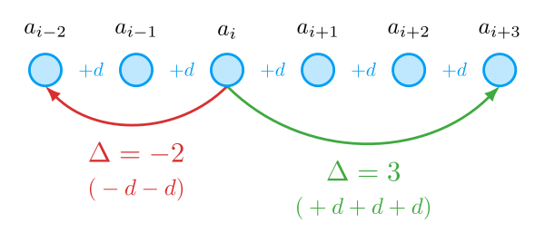

---
{
    "title":    "Последовательности",
    "desc":     "Статья про последовательности",
    "tags":     ["последовательность", "прогрессия", "арифметическая прогрессия", "геометрическая прогрессия"]
}
---

# Последовательности

Привет, мир! Короче, тут небольшой вступительный текст.

Это петр!

## Понятие последовательности {: #sequence }

Начем наше погружение в мир последовательностей с разбора самого этого понятия. Что это вообще такое?

Проведем аналогии с реальность жизнью. Например, вот последовательность действий для приготовления макарон:

1. Заполнить кастрюлю водой
2. Довести воду до кипения
3. Засыпать макароны
4. Готовить в течении 10 минут

Заметьте, что во всех примерах выше мы

<definition id="sequence">
    <def>Последовательность</def> — функция $f: \N \to X$, которая каждому натуральному числу ставит в соответствие какой-то элемент множества $X$.
</definition>

## Числовая последовательность {: #number-sequence }

Из введенного ранее <d:[определения](sequence)> последовательности следует, что мы нумеруем элементы какого-то произвольного множества $X$.
Так вот, если множество $X$ состоит только из чисел, то есть $X\subseteq R$, то выходит, что мы нумеруем числа. Поэтому, такие последовательности называют числовыми.

<definition id="number-sequence">
    <def>Числовая последовательность</def> — последовательность, значениями которой являются числа.
</definition>

<todo>Рассказать про обозначения, чтобы не делать этого потом!</todo>

## Арифметическая прогрессия

Взгляните на последовательности ниже. Можете ли вы установить закономерность, по которой получены элементы каждой из них?

$$ 1, \ 2, \ 3, \ 4, \ 5, \ \ldots \qquad \qquad 6, \ 3, \ 0, \ -3, \ -6, \ \ldots  $$

В первом случае все очевидно. Это последовательность натуральных чисел. Что более важно для нас — каждый член этой последовательности получается прибавлением $1$ к предыдущему члену.
При этом, самый первый член этой последовательности равен $1$. Говоря более формально, последовательность натруальных чисел можно описать вот так:

$$ a_n = a_{n-1} + 1 \qquad a_1 = 1 $$

Аналогичные рассуждения можно провести и для последовательности справа. Замечаем, что каждый следующий ее член получаем при вычитании $3$ (или прибавлении $-3$) из предыдущего члена. Первый член равен $6$. Формально эту последовательность можно описать так:

$$ a_n = a_{n-1} + (-3) \qquad a_1 = 6 $$

Заметьте, что обе эти последовательности похожи друг на друга в том смысле, что для получения следующего члена мы всегда прибавляем одно и то же число к предыдущему.
Все подобные последовательности называются арифметическими прогрессиями.

<definition id="arifm-progression">
    <def>Арифметическая прогрессия</def> — числовая последовательность, каждый член которой (кроме первого) получается прибавлением к предыдущему константы, называемой <def>разностью</def> прогрессии.
</definition>

{: .w7 }

<theorem title="Общий член арифметической прогрессии">
    <statement>
        Член $a_{i+\Delta}$, "сдвинутый" относительно члена $a_i$ на $\Delta$ "номеров" вправо или влево, отличается от него на число $d\Delta$:

        $$ a_{i+\Delta} = a_{i} + d\Delta \qquad (i, i+\Delta \in \N, \ \Delta \in \Z) $$
    
        **Следствия:**
        * Общий член через произвольный: $ a_m = a_n + d(m-n) $
        * Общий член через первый член: $a_n = a_1 + d(n-1)$
    </statement>
    <proof>
        Если $\Delta = 0$, то получаем очевидно выполняющееся равенство:

        $$ a_{i+0} = a_{i} + d\cdot 0 = a_{i} $$

        Докажем теперь справедливость формулы для натурального $\Delta$ с помощью метода математической индукции.

        **База индукции:** при $\Delta = 1$ получаем

        $$ a_{i+1} = a_{i} + d $$

        Это равенство выполняется по <d:[определению](arifm-progression)> арифметической прогрессии. База индукции доказана.

        **Индукционный переход:** пусть доказываемое равенство выполняется при $\Delta = k$:

        $$ a_{i+k} = a_i + dk $$

        По <d:[определению](arifm-progression)> арифметической прогрессии следующий член $a_{i+(k+1)}$ можно получить, прибавив разность к предыдущему члену $a_{i+k}$:

        $$ a_{i+(k+1)} = a_{i+k} + d $$

        Заменим $a_{i+k}$ на формулу выше и получаем следующее равенство:

        $$ a_{i+(k+1)} = a_{i} + dk + d = a_{i} + d(k+1) $$

        Мы доказали, что равенство выполняется и для $\Delta = k+1$. То есть, формула работает для любых натуральных $\Delta$.

        Доказательство для отрицательных целых $\Delta$ проводится так же по методу математической индукции по $\Delta ' = -\Delta$.

        $\blacksquare$
    </proof>
</theorem>

<theorem title="Характеристическое свойство арифметической прогрессии">
    <statement>
        Если $\set{a_n}$ — арифметическая прогрессия, то для любого $n$ выполняется равенство

        $$ a_n = \frac{a_{n-\Delta} + a_{n+\Delta}}{2} $$

        Обратное тоже верно. Если равенство выше выполняется для любого $n$, то $\set{a_n}$ — арифметическая прогрессия.
    </statement>
</theorem>

## Монотонная последовательность {: #monotonic-sequence }

<cross title="Монотонная функция" id="algebra/f-properties/monotonic" />